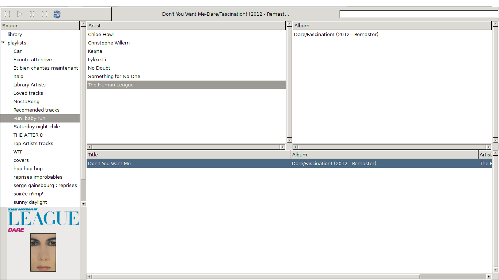

Google Music Player
===================

A GTK music player based on google music API

INSTALL
-------

.. code::

    apt-get install python-gtk virtualenv vlc
    virtualenv venv --system-site-packages
    source venv/bin/activate
    pip install googlemusicplayer
    run

enjoy! ;)

FEATURES
--------

- play library
- playlist
- radios

- get album covers
- play/pause/previous/next

NEW! LASTFM integration
-----------------------

If you have a lastfm account and want to scrobble your tracks, please
add to your ~/.config/google_music_player your lastfm username and
password:

.. code::

   googleemail@gmail.com
   google_password
   lastfm_username
   lastfm_passsword
